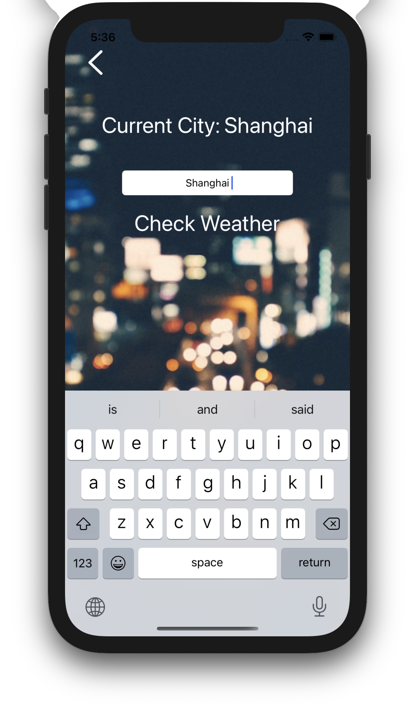

# Real time weather checking App based on user location
### About WeatherAPI

Weather data used in this app is based on [QWeather data service](https://dev.qweather.com/en/), you need to sign in and get a WebAPI key first. You can also use other WeatherAPIs, but make sure to replace `weatherPath` and `cityPath` with URLs of your weatherAPIs.

### Check current weather and query

&nbsp&nbsp

### Swift Package Dependencies

Swift Packages from these great repositories are used during developing.

• [Alamofire](https://github.com/Alamofire/Alamofire)

• [SwiftyJSON](https://github.com/SwiftyJSON/SwiftyJSON)

